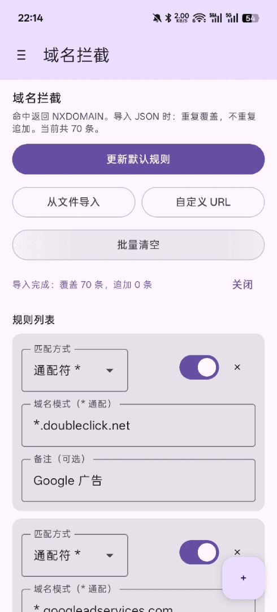

# 速析 DNS（suxi_dns）

本地 DNS 分流与加速客户端。通过 Android `VpnService` 接管设备的 DNS 查询，转发到你配置的多个上游 DNS。上游按**分组**组织：**组内并发竞速取最快，组间按顺序 fallback**，并带进程内 DNS 缓存，减少重复上游往返与射频唤醒。

| 项 | 值 |
|----|----|
| 展示名 | 速析 DNS |
| 项目名 | `suxi_dns` |
| 包名 | `com.lhstack.suxi.dns` |
| 当前版本 | `1.0.1`（versionCode 2） |
| 最低系统 | Android 7.0（API 24） |

> DNS VPN 能力目前仅 Android 实现。仓库仍保留 Kotlin Multiplatform / iOS 模板结构，但 iOS 侧没有同等 VPN 功能。



---

## 功能特性

- **分组 fallback + 组内并发竞速**：上游按分组组织。组内所有启用上游同时查询，取第一个通过校验的响应，其余取消；当前组全部失败才 fallback 到下一组，全部组失败返回 SERVFAIL。组的顺序即 fallback 顺序，可在界面**长按拖拽**调整。
- **DNS 缓存**：进程内按「域名 + 查询类型」缓存响应，按答案区最小 TTL 过期（不缓存 SERVFAIL），命中直接返回，不发起上游请求。
- **多协议上游**：
  - **UDP**（传统 DNS，默认端口 53）
  - **HTTP** / **HTTPS**（DoH，`application/dns-message`）
  - **HTTP/3**（Cronet + QUIC，要求协商为 h3，不静默降级到 HTTP/2）
- **配置持久化**：分组列表保存在应用私有目录 `dns_servers.json`，启动时加载到内存，增删改即时写回；旧版扁平上游数组在加载时自动迁移为单个分组。
- **自定义解析**：本地 A / AAAA / CNAME 记录，支持 `*` 通配与 TTL；CNAME 可链式补全 A/AAAA。
- **域名拦截**：通配符 / 正则规则，命中返回 NXDOMAIN；支持文件 / URL 批量导入与更新默认规则。
- **首次启动初始化**：无本地配置时自动写入默认两个分组（首选组 = 223.6.6.6/223.5.5.5 UDP 并发；备用组 = 对应 HTTP/3 fallback）与内置拦截规则。
- **运行日志**：首页内存日志（最多 100 条），含域名、解析结果、命中上游或缓存、耗时；进程结束后丢弃，不落盘。
- **轻量 VPN 路由**：仅路由虚拟 DNS 地址 `10.10.10.2/32`，不接管普通上网流量。
- **上游防回环**：UDP 等原生 socket 调用 `VpnService.protect()`，避免查询再次进入 VPN TUN。

---

## 工作原理（简要）

```
应用/系统 DNS 查询
    → 系统发往虚拟 DNS 10.10.10.2:53（IPv4 UDP）
    → DnsVpnService 从 TUN 读包并解析
    → 拦截规则 → 本地解析 → DNS 缓存命中直接返回
    → 未命中：CompositeResolver 按分组 fallback（组内并发竞速）
    → 首个合法 DNS 响应写回 TUN 并写入缓存
    → 全部分组失败则返回 SERVFAIL
```

```
UI / ViewModel
    → DnsVpnService（前台服务 + TUN）
        → CompositeResolver（竞速）
            → 按组顺序 fallback，组内并发
                → UdpDnsResolver | HttpDnsResolver | Http3DnsResolver
```

---

## 模块结构

```
suxi_dns/
├── androidApp/          # Android 入口、Compose UI、VPN、上游传输
├── shared/              # KMP 共享：DNS 配置模型等
├── iosApp/              # iOS 模板入口（无 DNS VPN 实现）
├── gradle/
└── README.md
```

主要 Android 源码（包名 `com.lhstack.suxi.dns`）：

| 路径 | 说明 |
|------|------|
| `MainActivity.kt` | 入口与 VPN 授权 |
| `ui/DnsConfigScreen.kt` | 首页 / DNS 分组配置页（含组拖拽排序） |
| `ui/DnsConfigViewModel.kt` | 分组配置状态、校验、启停 VPN |
| `dns/DnsVpnService.kt` | TUN、前台通知、请求处理、DNS 缓存接入 |
| `dns/DnsResponseCache.kt` | 进程内 DNS 响应缓存（按 TTL 过期） |
| `dns/DnsServerStore.kt` | 分组 JSON 配置读写与旧格式迁移 |
| `dns/Ipv4UdpDnsPacket.kt` | IPv4/UDP/DNS 报文 |
| `dns/resolver/CompositeResolver.kt` | 分组 fallback + 组内竞速 |
| `dns/resolver/UdpDnsResolver.kt` | UDP |
| `dns/resolver/HttpDnsResolver.kt` | HTTP / HTTPS DoH |
| `dns/resolver/Doh3Resolver.kt` | HTTP/3 DoH |

---

## 环境要求

- JDK 17+
- Android SDK（compileSdk / targetSdk 36）
- 推荐使用 Android Studio 打开工程
- 可选：Xcode（仅当需要构建 iOS 模板）

技术栈概览：Kotlin 2.4、AGP 8.12、Gradle 9.1、Jetpack Compose、OkHttp（HTTP/HTTPS）、Cronet（HTTP/3）。

---

## 构建与运行

### 编译 / 打包 Android

```bash
# 编译
./gradlew :androidApp:compileDebugKotlin

# 打 Debug APK
./gradlew :androidApp:assembleDebug
```

APK 输出路径：

```text
androidApp/build/outputs/apk/debug/androidApp-debug.apk
```

也可在 Android Studio 中直接 Run `androidApp`。

### 测试

```bash
./gradlew :shared:testAndroidHostTest
```

iOS 模拟器测试（需本机 Xcode）：

```bash
./gradlew :shared:iosSimulatorArm64Test
```

---

## 使用说明

1. 安装并打开 **速析 DNS**（首次启动会自动初始化默认上游与拦截规则）。
2. 左上角菜单：
   - **DNS 服务器**：默认两个分组（首选 UDP 并发、备用 HTTP/3 fallback）；组可增删改名、整体启停、组内增删上游，长按左侧手柄拖拽调整组顺序
   - **自定义解析**：本地 A/AAAA/CNAME + TTL
   - **域名拦截**：规则列表可滚动；可「更新默认规则」/ 文件 / 自定义 URL 导入 JSON
3. 回到 **首页**，点击 **启动**，授予系统 VPN 权限。
4. 正常使用网络；首页日志可查看解析域名、结果 IP、命中上游与耗时。
5. 需要修改配置时，先 **停止** VPN，再编辑。

### 配置存储

| 文件 | 说明 |
|------|------|
| `dns_servers.json` | DNS 分组（含各组上游） |
| `local_dns_records.json` | 自定义解析 |
| `domain_block_rules.json` | 域名拦截 |

- 启动 App → 读入内存；增删改/开关 → 立即写回
- 启动 VPN 时从**内存中的配置**加载到服务
- 查询顺序：**拦截 → 本地解析 → 上游竞速**

### 日志

- 仅进程内存，最多保留 **最新 100 条**
- 上游命中示例：`example.com → 1.2.3.4 | 上游 udp://223.5.5.5:53 | 28ms | 61字节`
- 缓存命中示例：`example.com → 1.2.3.4 | 缓存 | 0ms`

### 版本说明（1.0.1）

详见 [`CHANGELOG.md`](./CHANGELOG.md)。

---

## 当前能力边界

以下能力**尚未**实现，请按现状使用：

| 项目 | 说明 |
|------|------|
| IPv6 DNS | 仅处理 IPv4 UDP/53 |
| TCP/53 | 未支持 |
| DoQ（DNS over QUIC） | 已移除 |
| 全流量 VPN | 仅 DNS 虚拟地址路由 |
| DNSSEC | 未做 |
| iOS DNS VPN | 未实现 |

上游填写建议：

- UDP 可直接填 IP（如 `223.5.5.5`）
- HTTPS / HTTP/3 优先填**证书对应域名**（如 `dns.alidns.com`），并保证 VPN 建立后仍能解析该域名，或后续再扩展 bootstrap 配置；不要依赖未声明的静默回退

---

## 设计原则（实现约束）

- **错误显式暴露**：全部上游失败返回 SERVFAIL，并在日志中保留原因；不伪造解析结果。
- **无静默降级**：HTTP/3 必须确认协商为 h3/quic，不能把 HTTP/2 当 HTTP/3。
- **分组竞速**：组内多上游并行竞速取最快；组间按用户配置的顺序 fallback，首个合法响应写回 TUN，只写一次。
- **缓存不掩盖失败**：只缓存 NOERROR / NXDOMAIN，SERVFAIL 等失败不入缓存，避免短时错误被放大。
- **最小必要修改**：分组 fallback 是用户显式配置的顺序，不是为兼容历史异常添加的隐式降级。

更细的工程约定见仓库内 [`AGENTS.md`](./AGENTS.md)。

---

## 许可证与声明

本项目用于个人/学习场景下的自定义 DNS 解析。使用公共 DNS 请遵守对应服务商条款；在受管理的设备或网络上使用前请确认本地政策允许。
